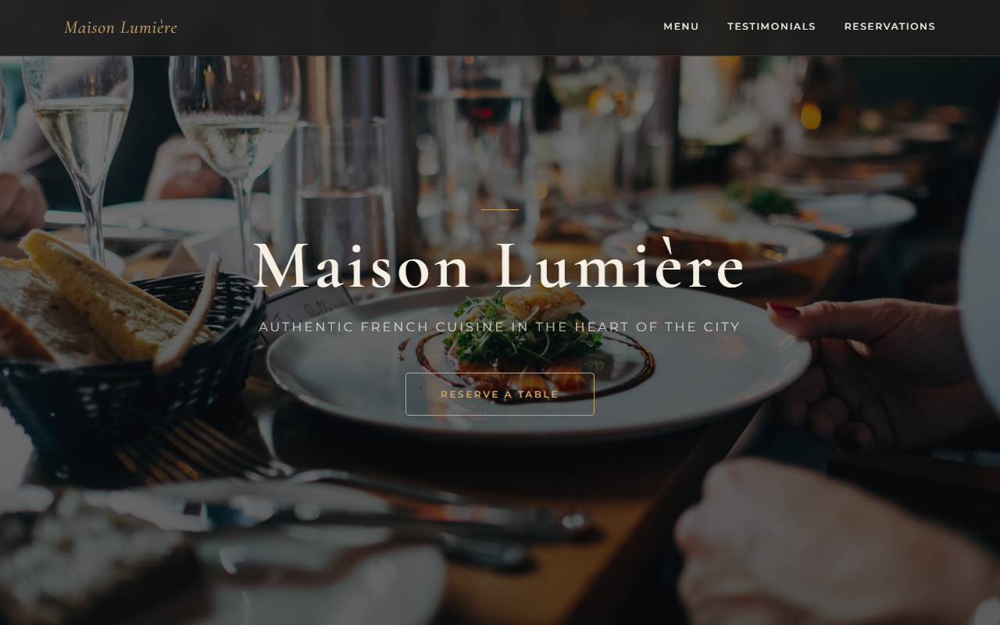

# Dragon Palace

A high-class Chinese restaurant website built with vanilla HTML, CSS, and JavaScript — featuring a full reservation form, testimonial carousel, and imperial red-and-gold design system.

## Live Site

[https://makwkk.github.io/restaurant-/](https://makwkk.github.io/restaurant-/)

## Screenshot



## Features

- Full-bleed hero with parallax background and crimson overlay
- Scroll-triggered fade-up animations via `IntersectionObserver`
- Multi-category menu with a featured signature-dish card
- Auto-advancing testimonial carousel with swipe, dot, and arrow controls
- Reservation form with client-side validation and success feedback
- Responsive mobile nav with animated hamburger toggle
- Dark red-and-gold design system using CSS custom properties
- No build step — open directly in a browser

## Tech Stack

- HTML5
- CSS3 (custom properties, flexbox, grid, backdrop-filter)
- Vanilla JavaScript (ES5-compatible IIFE)
- Google Fonts: Ma Shan Zheng, Cormorant Garamond, Montserrat
- Unsplash for food imagery

## Run Locally

No dependencies or build step required. Open `index.html` directly in any browser:

```
# Windows
start index.html
```

## File Overview

| File | Purpose |
|---|---|
| `index.html` | Single-page Dragon Palace restaurant website |
| `styles.css` | All styling — design tokens, layout, animations, responsive |
| `script.js` | All behaviour — fade-up observer, mobile nav, carousel, form validation |
| `.github/workflows/deploy.yml` | GitHub Actions workflow for automatic Pages deployment |
